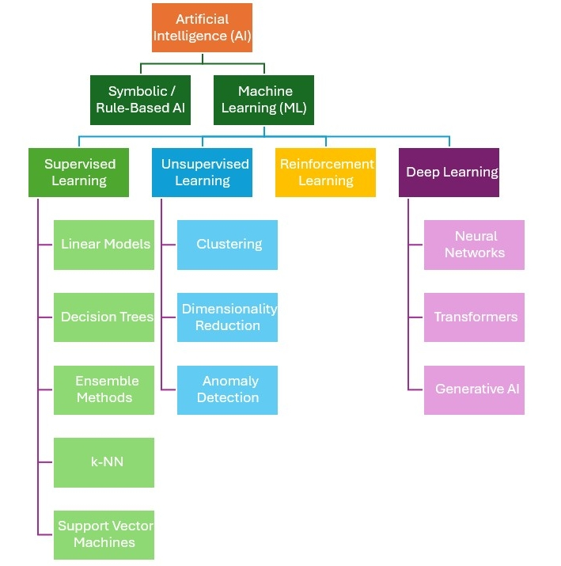
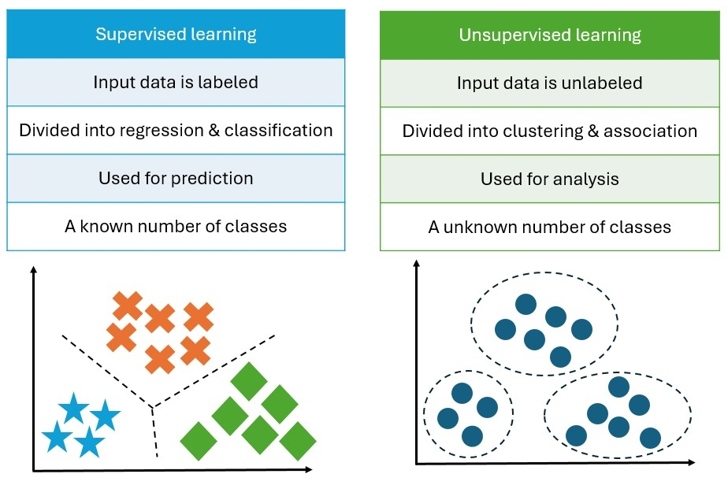
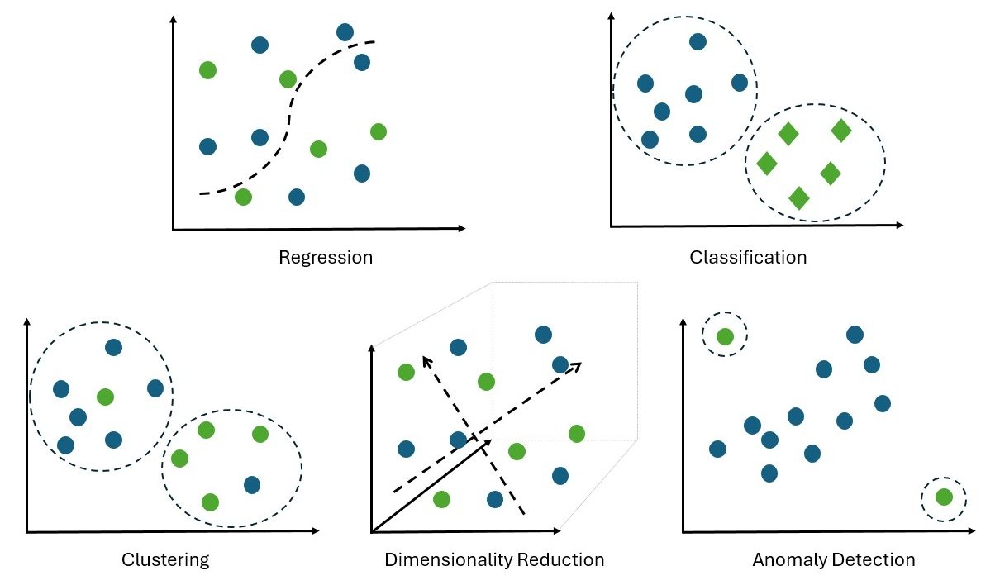
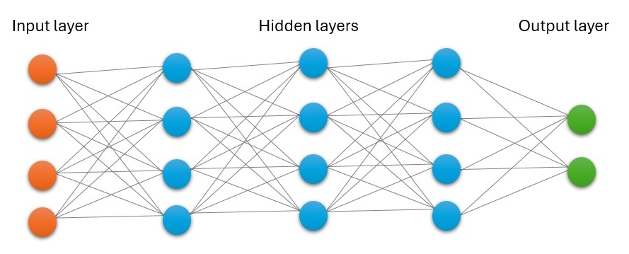

:::::::::::::::::::::::::::::::::::::: questions

- What is machine learning and how is it used for geospatial data analysis?
- What is the difference between supervised and unsupervised learning?
- What is the difference between machine learning and deep learning?
- When should you use machine learning for geospatial data analysis?

::::::::::::::::::::::::::::::::::::::::::::::::

::::::::::::::::::::::::::::::::::::: objectives

- Explain machine learning concepts for geospatial data
- Describe difference between supervised and unsupervised learning
- Describe the difference between regression, classification and clustering tasks
- Describe the difference between machine learning and deep learning
- Explain the usefulness of machine learning for geospatial data analysis

::::::::::::::::::::::::::::::::::::::::::::::::

## Machine learning

In data analysis, we often define a mathematical algorithm to show the
relationship between a set of input variables and an output variable. This is
called a model. In mathematical notation, the predicted value $\hat{y}$ can be
written as:

$\hat{y}(w, x) = w_0 + w_1 x_1 + \dots + w_n x_n$

Where $w$ are the model parameters, $x$ are the input variables or "data
matrix". We can adjust the model parameters $w$ to improve how well the model
can produce the output variable from the input variables. Therefore, we are
interested in the difference between the predicted value $\hat{y}$ and the true
value $y$. This is called the "error", and we can write its magnitude as:

$e = |y - \hat{y}|$

The process of adjusting the model parameters to minimize the error is called
"training" the model. One way to do this is to use a lot of samples of input and
output data, and use an "optimization" algorithm to find the best model
parameters that minimize the error. This is called "fitting" the model to the
data. In other words, the model "learns" from the data by adjusting its
parameters to minimize the error. When we find the best model parameters that
minimize the error, we can use the model to make predictions (or inferences) on
new data. Whether the predictions are useful depends on the training data,
evaluation metrics, and the generalization ability of the model.

The whole process of training a model, defining optimization algorithms, and
using the model to make predictions is called [machine learning
(ML)](https://en.wikipedia.org/wiki/Machine_learning).

::::::::::::::::::::::::::::::::::::: callout

Data matrix

A data matrix is a structured representation of data where rows typically
correspond to individual samples or observations, and columns correspond to
features or variables. In the context of machine learning, the data matrix is
used as input to train models and make predictions.

::::::::::::::::::::::::::::::::::::::::::::::::

## Machine learning family tree

Machine learning (ML) is a subset of artificial intelligence (AI). Artificial
intelligence (AI) is the capability of a machine or software system to perform
tasks that would normally require human intelligence, such as learning from
data, recognising patterns, making decisions, or generating
outputs.

AI research began with rule-based approaches focused on logic. Rule-based
systems are deterministic, in other words the same inputs always lead to the
same outputs, and the rules governing behaviour are explicitly defined.

AI research then moves toward statistical and data-driven methods. Rather than
following fixed rules, these systems use statistical models to learn patterns
from data and make predictions, classifications or risk estimates.

Deep learning is a subset of machine learning that uses neural networks with
many layers to learn representations of data. Neural networks are composed of
interconnected layers of nodes (neurons) that transform input data into
meaningful output through learned weights and activation functions.

{alt="AI family tree"}

## Supervised and unsupervised learning

Supervised machine learning involves the use of labelled datasets (or annotated
datasets) to train models. Unsupervised machine learning, on the other hand,
attempts to identify meaningful patterns within unlabelled datasets.

{alt="Supervised and unsupervised learning"}

::::::::::::::::::::::::::::::::::::: challenge

### Challenge 1: supervised or unsupervised learning?

Look at [the dataset](../learners/setup.md) we will be using in this lesson.
We want to ... (FIXME)

:::::::::::::::::::::::: solution

## Answer

:::::::::::::::::::::::::

::::::::::::::::::::::::::::::::::::::::::::::::

## Machine learning tasks

Machine learning tasks can be broadly categorized into several types, including:

- **Regression:** Predicting a continuous numerical value based on input features.
- **Classification:** Assigning input data to one of several predefined categories.
- **Clustering:** Grouping similar data points together without predefined labels.
- **Dimensionality Reduction:** Reducing the number of input features while preserving important information.
- **Anomaly Detection:** Identifying unusual or rare data points that deviate from the norm.

{alt="Machine learning tasks"}

## Deep learning

Deep learning is a subset of machine learning that uses neural networks with
multiple layers. These networks are capable of learning complex patterns and
representations from large amounts of data.

{alt="Neural network"}

Neural networks consist of interconnected layers of nodes (neurons) that process
input data through weighted connections and activation functions.

Each neuron …
- has one or more inputs,
- most of the time, conducts 3 main operations:
    - take the weighted sum of the inputs
    - add a bias term (i.e., constant weight)
    - apply an "activation function" to the result; an activation function
      converts the weighted sum of the inputs to the output signal of the
      neuron.
- produce an output that is passed to the next layer of neurons.

::::::::::::::::::::::::::::::::::::: challenge

### Challenge 2: Activation functions

https://carpentries-lab.github.io/deep-learning-intro/1-introduction.html#what-is-deep-learning (FIXME)

:::::::::::::::::::::::: solution

## Answer

:::::::::::::::::::::::::

::::::::::::::::::::::::::::::::::::::::::::::::

### Model parameters

During training, the neural network adjusts the weights and biases of the
connections between neurons to minimize the error between the predicted output
and the true output. The weights and biases are the model's parameters; when you
read about, for example a model having 1 million parameters, it means that the
model has 1 million weights and biases that can be adjusted during training.

### Optimization algorithms

### Types of deep learning models

## Geospatial machine learning

Geospatial ML is the application of machine learning techniques to data with a
spatial and spatio-temporal components.

Machine learning is a powerful tool for geospatial analytics because it can
leverage large amounts of spatial data, time series data, satellite and aerial
imagery, or any other form of geographic information to do tasks such as
predictions, classification, or identifying patterns in the data. The
application of machine learning to geospatial data is vast; for example,
predicting the spread of wildfires, classifying land cover types, or identifying
areas at risk of flooding.

::::::::::::::::::::::::::::::::::::: keypoints

::::::::::::::::::::::::::::::::::::::::::::::::
